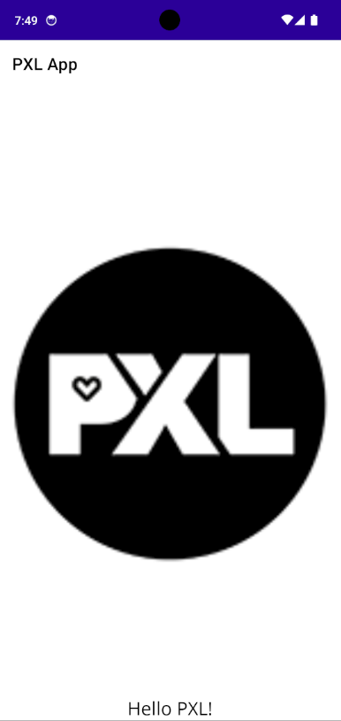
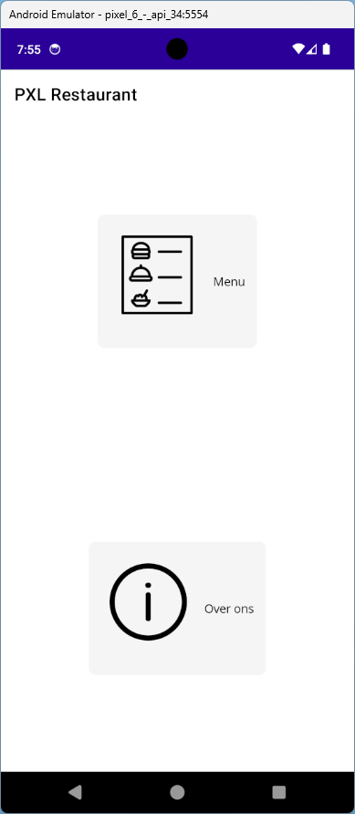
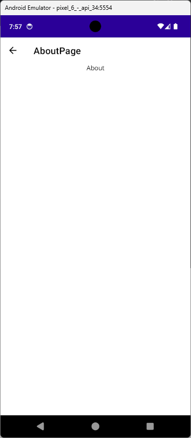

# Hello PXL!

- Clone en open de repository in Visual Studio 2022

## Deel 1 - Content pages
- Voeg een nieuwe content page toe aan de applicatie: 
	- Maak hiervoor een folder *Pages*
	- Geef het nieuwe component de naam *HelloPage*
- Wijzig de AppShell zodat de nieuwe content page getoond wordt als startpagina
- Verwijder de volledige inhoud van de content page en voeg een image toe: 
	- zorg dat de image het enige *child* is
	- gebruik de [online documentatie](https://learn.microsoft.com/en-us/dotnet/maui/user-interface/controls/?view=net-maui-8.0) om het PXL logo te tonen via deze URI:
	``` 
	https://www.pxl.be/media/mn0phfug/image.png
	```
- Voeg nu onder de image een label toe met de tekst "Hello PXL!"
	- Wat is het gevolg?
	- Welke stappen moeten ondernomen worden?

> Tip: [Layouts](https://learn.microsoft.com/en-us/dotnet/maui/user-interface/layouts/?view=net-maui-8.0) & [Alignment](https://learn.microsoft.com/en-us/dotnet/maui/user-interface/layouts/?view=net-maui-8.0)



## Deel 2 - Navigatie
- Maak 3 nieuwe content pages aan in de *Pages* folder:
	- HomePage
	- MenuPage
	- AboutPage
- Voorzie de MenuPage en de AboutPage van een *Label* zodat er een zichtbaar verschil is tussen de 2 pages

### HomePage
- Geef de pagina de titel *PXL Restaurant*
- Voorzie de volgende XAML code als enige inhoud:
```
<Grid>
    <Grid.RowDefinitions>
        <RowDefinition Height="*"/>
        <RowDefinition Height="*"/>
    </Grid.RowDefinitions>
    <Button ImageSource="menu.svg" Grid.Row="0" Text="Menu" TextColor="Black"
            HorizontalOptions="Center"
            VerticalOptions="Center" 
            Background="WhiteSmoke" />

    <Button ImageSource="about.svg" Grid.Row="1" Text="Over ons" TextColor="Black"
            HorizontalOptions="Center"
            VerticalOptions="Center" 
            Background="WhiteSmoke" />
</Grid>
```
- Voorzie voor elke knop een *Clicked*-eventhandler 
- Registreer de *routes* voor de MenuPage en de AboutPage in AppShell.xaml.cs
```
Routing.RegisterRoute(nameof(MenuPage), typeof(MenuPage));
Routing.RegisterRoute(nameof(AboutPage), typeof(AboutPage));
```
- Zorg ervoor dat de knoppen navigeren naar de juiste pagina

   
